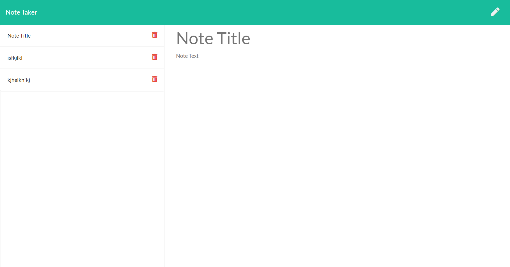

# Note Taker Starter Code

   

  ## Table of Contents 
  
  * [Description](#description)
  * [Installation](#installation)
  * [GitHub](#github)
  * [Languages](#languages)
  * [Usage](#usage)
  * [Screenshot](#screenshot)
  * [Test](#test)
  * [Contributions](#contributions)
  * [Questions](#questions)
  * [Credit](#credit)
  * [License](#license)
  
  ## Description

Have a busy day? Don't know where to start? Well, look no further. the note taker 44 is now available at a website near you. Just go to the link below to deploy the application. From there you can put in any tasks you need to complete AND delete them when they're completed.

  ## Installation

  Please install NPM and Inquirer to run this application.  
  Link to GitHub Repository: https://www.github.com/UPye/noteTaker
  Link to deployable page: https://notetaker44.herokuapp.com/notes
  
  ## Languages
  
  JavaScript, Node, Express
  
  ## Usage

  Once NPM, Express, UUID, and UUIDv4 is installed, you may run the application 

  ## Screenshot
    
  

  ## Test

  None as of yet.

  ## Contributions

  I would like to add the ability to add the notes to a calendar, so you'll know your deadline for when you should have them completed.

  ## Questions  

  GitHub Link: https://github.com/UPye/noteTaker

  Deployable link: https://notetaker44.herokuapp.com/notes
  
  Contact via Email: Urika.Pye@gmail.com

  ## Credit
  Google and YouTube University

  ## License
  